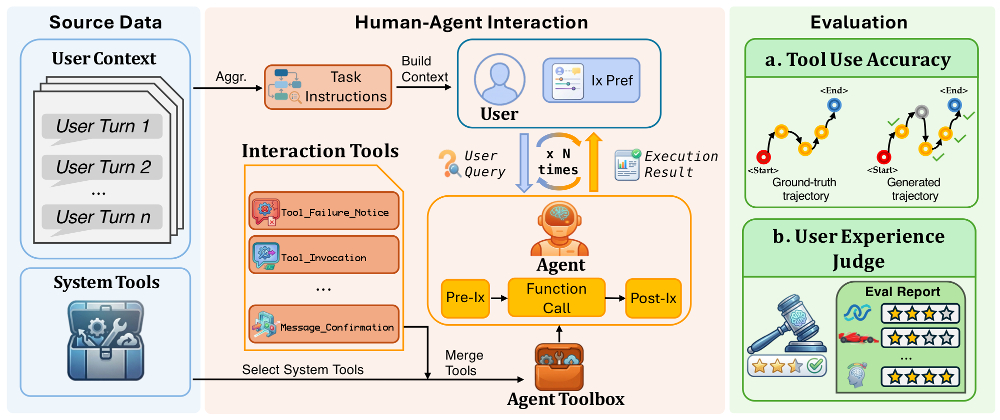

# PrefIx: Understand and Adapt to User Preference in Human-Agent Interaction

[](https://prefix-leaderboard.vercel.app/)
[](https://aclanthology.org/2026.findings-acl.1506/)
[](https://arxiv.org/abs/2602.06714)
[](https://github.com/JL10897/PrefIX)
[](./LICENSE)
[](https://github.com/JL10897/PrefIX)

This repo contains the code and data for the paper: *PrefIx: Understand and Adapt to User Preference in Human-Agent Interaction* (ACL 2026 Findings).

<p align="center">
  
</p>

---

## Overview

PrefIx is the first **UX benchmark for interaction preference** in LLM-based agents. LLM agents can complete tasks correctly yet still frustrate users through poor interaction patterns — excessive confirmations, opaque reasoning, or misaligned pacing. Existing benchmarks evaluate task accuracy but overlook *how* agents interact: whether they infer preferences from implicit cues, adapt dynamically, and maintain fine-grained interaction quality.

Central to PrefIx is the **Interaction-as-a-Tool (IaaT)** paradigm, which treats interaction behaviors (confirm, disambiguate, abort, escalate, …) as structured tool calls, unifying them with existing tool-use evaluation frameworks. PrefIx defines **31 preference settings across 14 attributes** and formalizes **user experience (UX)** as a core metric alongside task accuracy. A composite **LLM-as-a-Judge** mechanism across **7 UX dimensions** achieves strong aggregate reliability (ICC > 0.79), high internal consistency (α = 0.943), and human correlation (ρ = 0.52–0.78). Preference-aware agents show **7.6% average UX improvement** and an **18.5% gain in preference alignment**.

### Key Features

- **Interaction-as-a-Tool (IaaT)**: model interaction behaviors (confirm, disambiguate, abort, escalate, …) as callable tools alongside external APIs — unifying interaction evaluation with existing tool-use frameworks.
- **UX on equal footing with task accuracy**: a taxonomy of 14 interaction-preference attributes across 4 dimensions (transparency & auditability, interaction pace & flow, strategy & initiative, robustness & adaptability) → 31 settings; agents are judged on both *what* they accomplish and *how* they interact.
- **Reliable multi-judge UX scoring**: 4 LLMs independently score 7 UX dimensions and aggregate, removing single-judge bias. Reliability: ICC > 0.79, α = 0.943, human correlation ρ = 0.52–0.78.

---

## Environment

Conda environment name: `ix_personalization`.

The requirements exported from that environment are here:
- `<PROJECT_ROOT>/requirements.txt`

Setup:

```bash
conda create -n ix_personalization python=3.10
conda activate ix_personalization
pip install -r <PROJECT_ROOT>/requirements.txt
```

API keys live in:
- `<PROJECT_ROOT>/gorilla/berkeley-function-call-leaderboard/.env`

---

## Quick Start

All commands assume:

```bash
cd <PROJECT_ROOT>/gorilla/berkeley-function-call-leaderboard
export BFCL_PROJECT_ROOT="$(pwd)"
export PYTHONPATH="$BFCL_PROJECT_ROOT"
mkdir -p logs
export OPENROUTER_API_KEY=...                       # required
export OPENROUTER_BASE_URL="https://openrouter.ai/api/v1"  # optional
```

### 1. Initialize history

Mandatory before running any new model. It seeds the first lines of the simulator history to reflect the interaction preferences, including an initial error and model setup.

```bash
python scripts/bootstrap_history_from_template.py --model claude-opus-4-5-20251101-FC
```

### 2. Generate model outputs (4 test models)

Each script runs all personas with and without interaction history. They require the rewritten (coarsened) tasks in `<PROJECT_ROOT>/Processing`.

```bash
python scripts/run_persona_matrix_claude_opus_4_5_20251101.py
python scripts/run_persona_matrix_claude_sonnet_4_5_20250929.py
python scripts/run_persona_matrix_gemini_3_flash.py
python scripts/run_persona_matrix_kimi.py
```

**Test Models:**

| Display            | Model ID                          | Script                                              |
|--------------------|-----------------------------------|-----------------------------------------------------|
| Claude Opus 4.5    | `claude-opus-4-5-20251101-FC`     | `run_persona_matrix_claude_opus_4_5_20251101.py`    |
| Claude Sonnet 4.5  | `claude-sonnet-4-5-20250929-FC`   | `run_persona_matrix_claude_sonnet_4_5_20250929.py`  |
| Gemini 3 Flash     | `gemini-3-flash-FC`               | `run_persona_matrix_gemini_3_flash.py`              |
| Kimi K2            | `kimi-k2-0905-preview-FC`         | `run_persona_matrix_kimi.py`                        |

For long runs, use `nohup` with log/pid files, e.g.:

```bash
nohup <PROJECT_ROOT>/.conda/envs/ix_personalization/bin/python scripts/run_persona_matrix_claude_opus_4_5_20251101.py \
  > logs/persona_matrix_claude_opus_4_5_20251101.log 2>&1 & echo $! > logs/persona_matrix_claude_opus_4_5_20251101.pid
```

### 3. Correctness check (tool-use accuracy)

```bash
python -m bfcl_eval evaluate --model claude-opus-4-5-20251101-FC --test-category multi_turn_long_context
python -m bfcl_eval evaluate --model claude-sonnet-4-5-20250929-FC --test-category multi_turn_long_context
python -m bfcl_eval evaluate --model gemini-3-flash-FC --test-category multi_turn_long_context
python -m bfcl_eval evaluate --model kimi-k2-0905-preview-FC --test-category multi_turn_long_context
```

Aggregates are stored in:
- `<PROJECT_ROOT>/gorilla/berkeley-function-call-leaderboard/scores_persona` (personalization vs no_personalization)

### 4. LLM-as-judge (UX metrics)

Judge runner: `<PROJECT_ROOT>/gorilla/berkeley-function-call-leaderboard/bfcl_eval/eval_checker/LLM_as_a_judge/run_gemini_judge.py`

```bash
python bfcl_eval/eval_checker/LLM_as_a_judge/run_gemini_judge.py \
  --judge-model claude-opus-4.5 \
  --personalization all
```

**Judge Models:**

| Provider  | Model ID                          |
|-----------|-----------------------------------|
| Anthropic | `anthropic/claude-opus-4.5`       |
| Anthropic | `anthropic/claude-sonnet-4.5`     |
| Google    | `google/gemini-3-flash-preview`   |
| Moonshot  | `moonshotai/kimi-k2-0905`         |

Outputs are stored under:
- `<PROJECT_ROOT>/gorilla/berkeley-function-call-leaderboard/LLM_as_judge_score/<judge_model>/<test_model>/...`

### Progress & cleanup

```bash
# Progress check (persona coverage / completion status)
python scripts/check_persona_progress.py --model claude-opus-4-5-20251101-FC

# Tail the run log
tail -f logs/persona_matrix_gemini_3_flash.log

# Clean stale/incomplete simulator histories
python scripts/clean_history_logs.py
python scripts/clean_history_logs.py --model claude-opus-4-5-20251101-FC --variant personalization --delete-incomplete

# Determinism check (reruns and flags any non-reproducible outputs)
bash bfcl_eval/scripts/deterministic_checker.sh
```

History cleanup removes or truncates stale/partial simulator histories and optionally deletes incomplete runs, preventing old or broken histories from contaminating fresh evaluations after interrupted runs or prompt changes. The deterministic checker verifies that model outputs are repeatable for the same input; non-deterministic models may be disqualified from the leaderboard.

---

## Code Structure

Most code lives in `<PROJECT_ROOT>/gorilla/berkeley-function-call-leaderboard`.

- **Canonical model mapping**: `bfcl_eval/constants/model_config.py`
- **Human-readable model list**: `SUPPORTED_MODELS.md`
- **`<PROJECT_ROOT>/Processing`**: coarsened Task Instructions — BFCL v3's over-specified prompts (which force a single trajectory) are rewritten into high-level instructions that preserve task intent, parameters, and ordering (so ground-truth tool calls stay deterministic) while freeing the multi-turn interaction to express user preferences.
- **`bfcl_eval`**: core PrefIx pipeline.
- **`bfcl_eval/LLM_as_judge_analysis`**: analysis notebooks and CSVs for judge-based UX metrics, including multi-model comparisons and per-dimension breakdowns.
- **`bfcl_eval/user_simulator`**: simulator + prompts.
- **`bfcl_eval/model_handler`**: model handlers + gating mechanisms.
- **`LLM_as_judge_score_repro`**: reproducibility artifacts for LLM-as-judge.
- **`LLM_as_judge_score`**: layout is `judge_model / test_model / setting / preference / sample`.
- **`scores_persona`**: tool-use accuracy for personalization vs no_personalization.

---

## Citation

If you find PrefIx useful for your research, please cite our paper:

```bibtex
@inproceedings{li-etal-2026-prefix,
    title = "{P}ref{I}x: Understand and Adapt to User Preference in Human-Agent Interaction",
    author = "Li, Jialin  and
      Chen, Zhenhao  and
      Luo, Hanjun  and
      Salam, Hanan",
    editor = "Liakata, Maria  and
      Moreira, Viviane P.  and
      Zhang, Jiajun  and
      Jurgens, David",
    booktitle = "Findings of the {A}ssociation for {C}omputational {L}inguistics: {ACL} 2026",
    month = jul,
    year = "2026",
    address = "San Diego, California, United States",
    publisher = "Association for Computational Linguistics",
    url = "https://aclanthology.org/2026.findings-acl.1506/",
    pages = "30110--30149",
    ISBN = "979-8-89176-395-1"
}
```

```bibtex
@misc{li2026prefixunderstandadaptuser,
      title={PrefIx: Understand and Adapt to User Preference in Human-Agent Interaction},
      author={Jialin Li and Zhenhao Chen and Hanjun Luo and Hanan Salam},
      year={2026},
      eprint={2602.06714},
      archivePrefix={arXiv},
      primaryClass={cs.HC},
      url={https://arxiv.org/abs/2602.06714}
}
```

---

## License

PrefIx is released under the [MIT License](./LICENSE).

The vendored `gorilla/` directory (Berkeley Function-Call Leaderboard) retains its original [Apache License 2.0](./gorilla/LICENSE).
